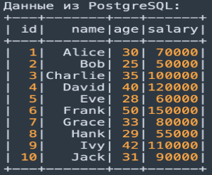
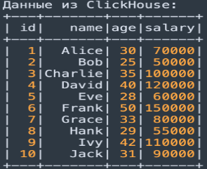
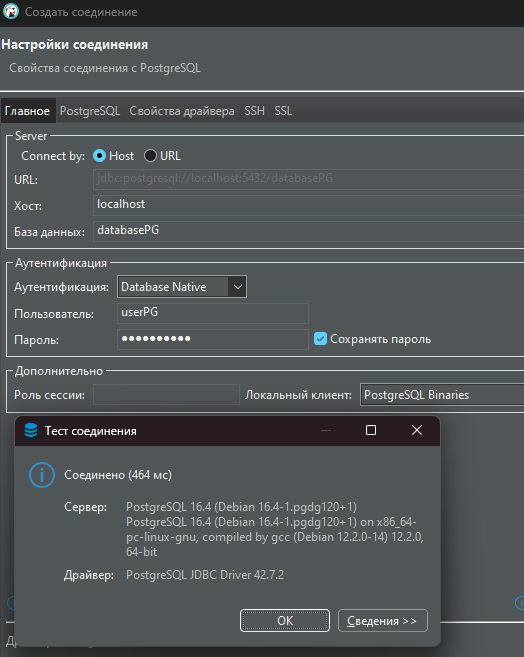
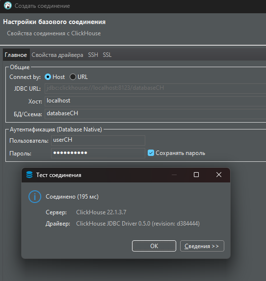
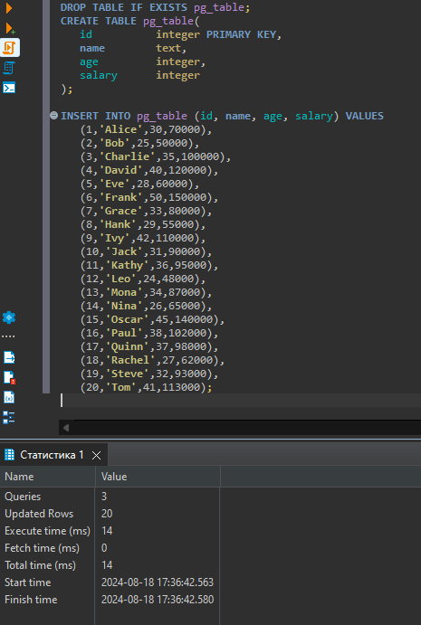
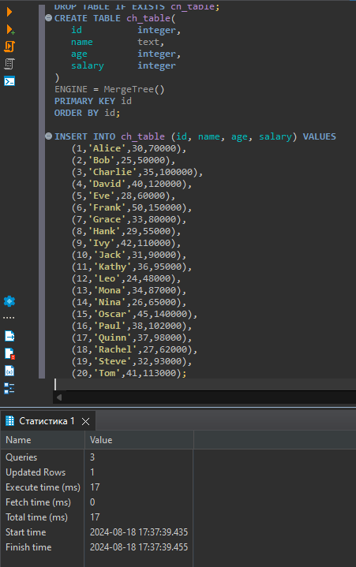
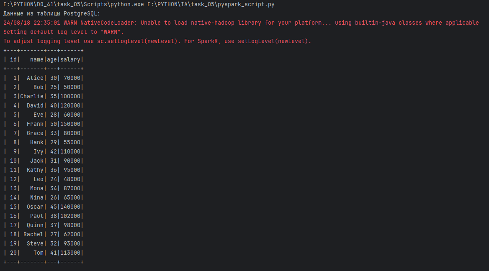
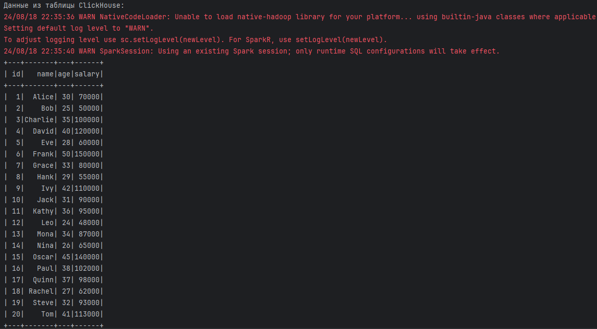

# Итоговая аттестация Задание 5.


## Создание Docker-контейнера с PostgreSQL и ClickHouse

## Цель:
Научиться развертывать базы данных PostgreSQL и ClickHouse в Docker с использованием Docker Compose, создавать таблицы и данные в этих базах данных, а затем использовать PySpark для чтения данных из обеих баз данных и работы с ними в рамках одного DataFrame.

## Описание задания:
- Создайте директорию для проекта и необходимые файлы.
- Создайте файлы create_table.sql, которые будут содержать SQL-запросы для создания таблиц и вставки данных в обе базы данных.
- В docker-compose.yml опишите конфигурацию для развертывания контейнеров с PostgreSQL и ClickHouse.
- Выполните команду для запуска контейнеров с PostgreSQL и ClickHouse.
- Создайте файл pyspark_script.py в вашем локальном окружении (вне Docker), который будет подключаться к обеим базам данных и читать данные.
- Вы должны увидеть вывод данных из обеих баз данных (PostgreSQL и ClickHouse), считанных и обработанных PySpark.



## Результат задания
 После выполнения задания у вас будет Docker-среда, в которой будет 2 базы данных. Используя PySpark, необходимо прочитать данные из обеих БД в рамках одного скрипта.

## Выполнение
- Запуск ```docker compose up -d```
- Подключение из DBeaver к PostgreSQL


- Подключение из DBeaver к ClickHouse


- Создание таблиц и вставка данных (для примера)



- Добавим в docker-compose.yml создание и вставку данных в базы данных, при разварачивании базы данных будут готовы к работе.

- Установить модули из файла requirements.txt
- Запустить файл pyspark_script.py


